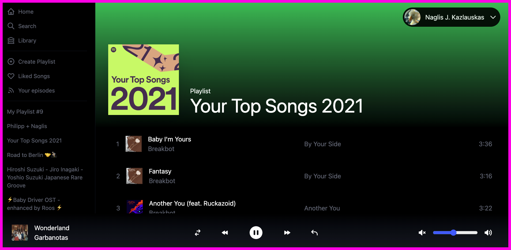
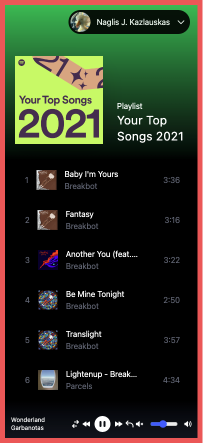

# Spotify Next JS Clone

Demo project made to test **Next.JS**

This is a responsive spotify player - where you can interact with your currently
played songs and control volume, change songs etc.

## Web

## Mobile

# Stack

1. NextJS.12
2. Next.JS Auth
3. Next.JS Middleware
4. Debouncing
5. OAuth & JWT Tokens
6. Tailwind
7. Apollo
8. Custom Hooks
9. Custom component generating scripts
